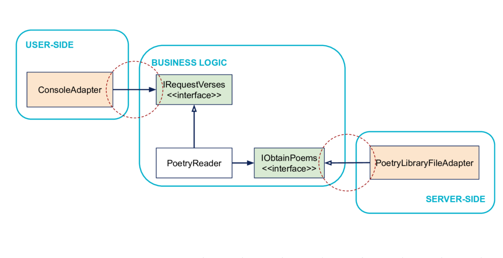

<p align="center">
  <a href="http://nestjs.com/" target="blank"></a>
</p>

## Description
### Use case
with a console the user must be able to display a Poem
### Architecture
<p align="center">
  <a href="https://blog.octo.com/architecture-hexagonale-trois-principes-et-un-exemple-dimplementation/" target="blank"></a>
</p>

### Implementation info
Domain language got from https://www.juicyenglish.com/blog/parts-of-a-poem.

This project has the main goal of practicing hexagonal architecture with a small use case.

It is written in Typescript.

Trainning built with [Nest](https://github.com/nestjs/nest)

## Installation

```bash
$ npm install
```

## Running the app

```bash
# development
$ npm run start

# watch mode
$ npm run start:dev

# production mode
$ npm run start:prod
```

## Test

```bash
# unit tests
$ npm run test

# e2e tests
$ npm run test:e2e

# test coverage
$ npm run test:cov
```

## License

Nest is [MIT licensed](LICENSE).
